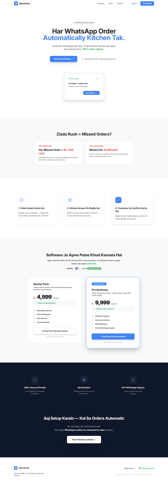
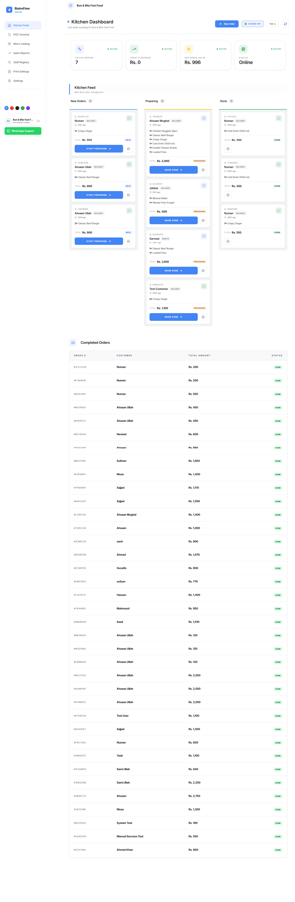
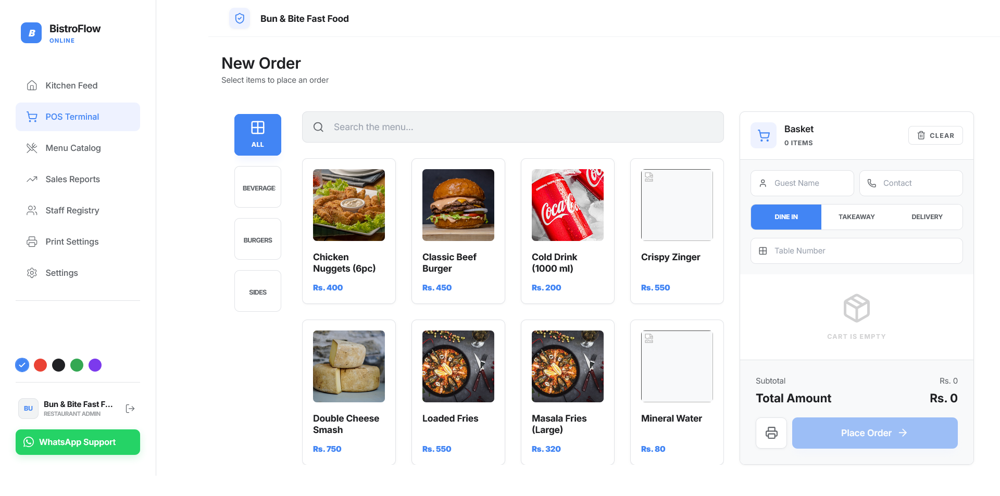
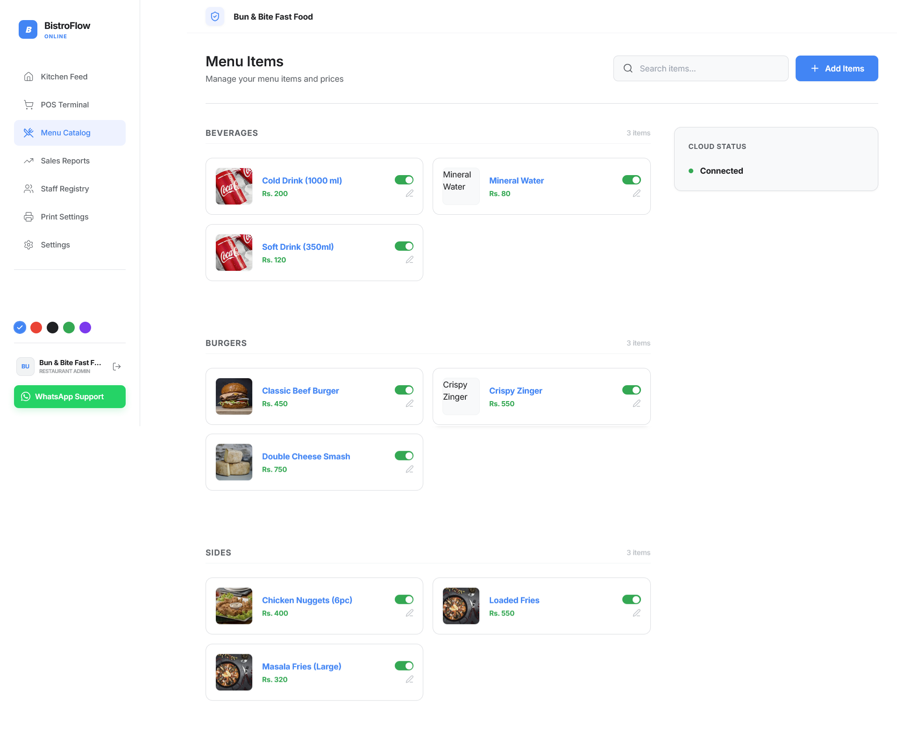
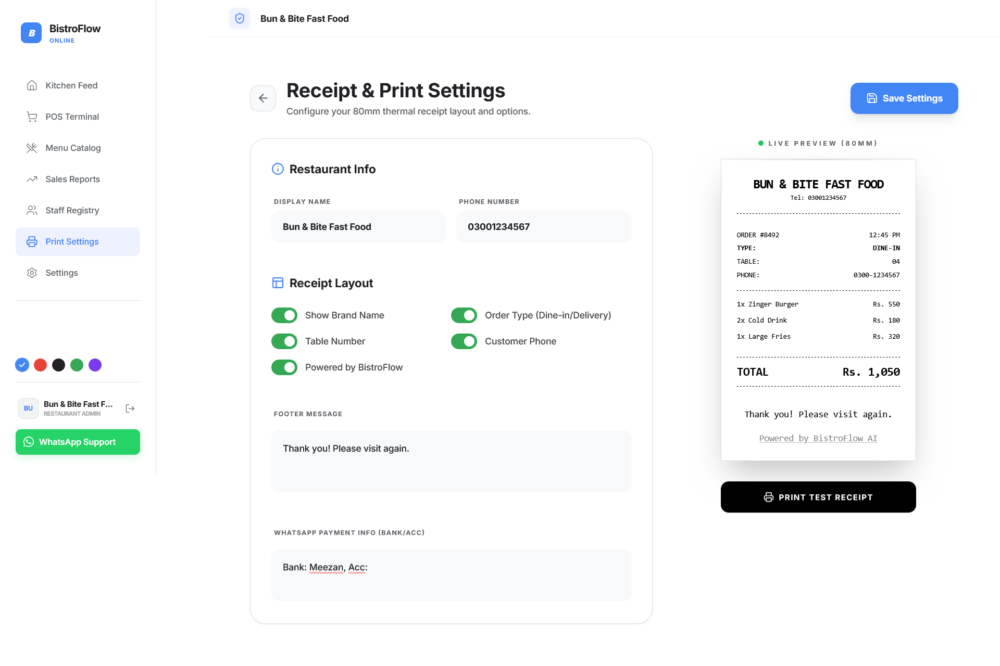
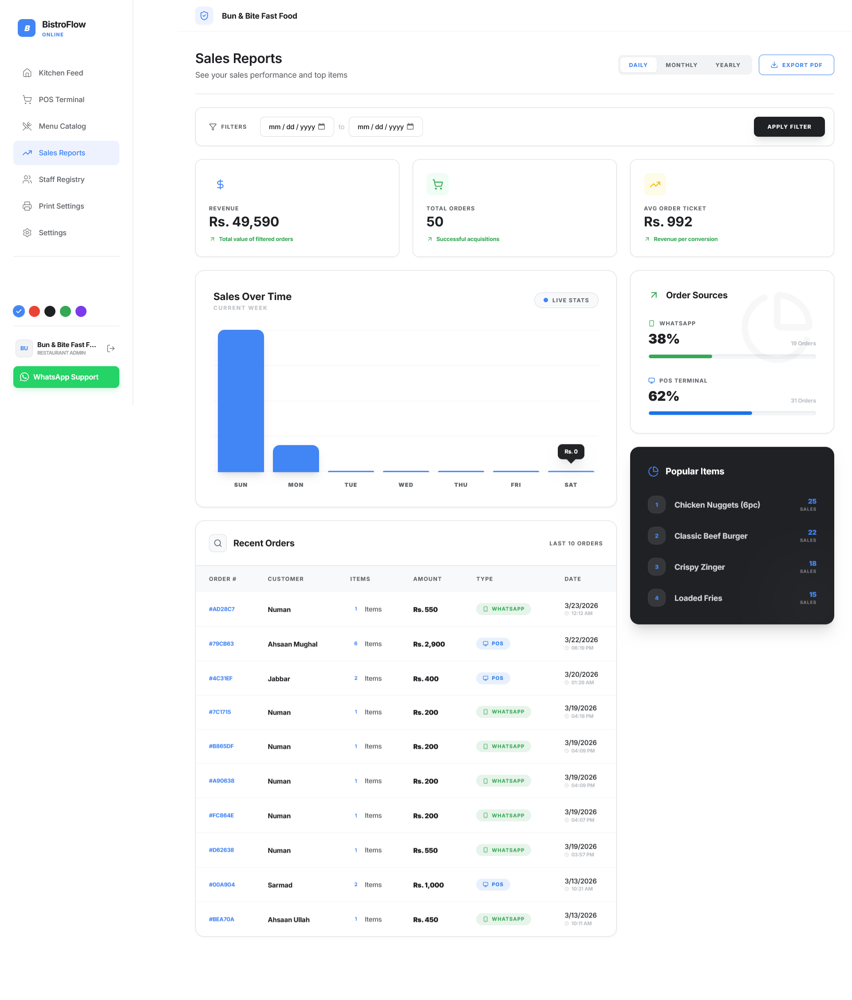

🍽️ BistroFlow AI — WhatsApp-Native Restaurant Operating System
Show Image
Show Image
Show Image
Show Image
Show Image
Show Image
Show Image

BistroFlow AI is a production-grade, multi-tenant restaurant management SaaS built specifically for Pakistani restaurants. Customers place orders directly via WhatsApp in Roman Urdu or English — no app download required.

🌐 Live Demo: bistroflow.vercel.app

🎯 The Problem
Pakistani restaurants rely on WhatsApp for orders — but managing them manually causes:

Lost orders in crowded chats
No real-time kitchen visibility
Zero sales analytics
Manual billing errors

BistroFlow AI solves all of this in one platform.

✨ What Makes It Different
| Feature            | BistroFlow AI                    | Traditional POS          |
|:-------------------|:---------------------------------|:-------------------------|
| Order channel      | WhatsApp (customers already use it) | Dedicated app required |
| Language support   | Roman Urdu + English             | English only             |
| Kitchen updates    | Real-time Kanban board           | Manual tickets           |
| AI integration     | Custom NLP + LLM fallback        | None                     |
| Setup time         | WhatsApp wizard in minutes       | Days of training         |
| Price              | Rs. 4,999/mo                     | Rs. 20,000+              |

🤖 AI & NLP Engine — The Core Innovation
This is not a simple chatbot wrapper. BistroFlow uses a custom-built NLP pipeline:

**Roman Urdu Parser (Custom Built)**

```
Customer types: "2 zinger 1 fries dena bhai"
                        ↓
        Tokenization + Number Word Mapping
                        ↓
        RapidFuzz Fuzzy Matching (≥60% confidence)
        against live menu catalog
                        ↓
        Structured Order: [{item: "Zinger Burger", qty: 2},
                           {item: "French Fries", qty: 1}]
```

- ✅ Handles spelling variations, slang, mixed language
- ✅ Confidence scoring on every match
- ✅ DeepSeek LLM fallback for complex/ambiguous queries
- ✅ Per-tenant bot personality customization

**Conversation State Machine**

```
BROWSING → COLLECTING_INFO → CONFIRMING → PENDING_PAYMENT → BROWSING
```

Full multi-turn conversation with memory per customer session.

🏗️ System Architecture
```
┌─────────────────────────────────────────────────────────┐
│                    CUSTOMER (WhatsApp)                   │
└──────────────────────┬──────────────────────────────────┘
                       │ Meta Cloud API Webhook
                       ▼
┌─────────────────────────────────────────────────────────┐
│              FastAPI Backend (Railway)                   │
│  ┌─────────────┐  ┌──────────────┐  ┌───────────────┐  │
│  │  Webhook    │  │  Roman Urdu  │  │   DeepSeek    │  │
│  │  Security   │  │   Parser     │  │  AI Fallback  │  │
│  │ HMAC-SHA256 │  │  RapidFuzz   │  │  (LLM layer)  │  │
│  └─────────────┘  └──────────────┘  └───────────────┘  │
│  ┌─────────────┐  ┌──────────────┐                      │
│  │   Redis     │  │  Supabase    │                      │
│  │ Rate Limiter│  │ REST Client  │                      │
│  │ Replay Guard│  │              │                      │
│  └─────────────┘  └──────────────┘                      │
└──────────────────────┬──────────────────────────────────┘
                       │
┌──────────────────────▼──────────────────────────────────┐
│              Supabase (PostgreSQL + Realtime)            │
│   11 tables · 33 migrations · Row Level Security        │
│   RPC stored procedures · PostgreSQL triggers           │
└──────────────────────┬──────────────────────────────────┘
                       │ Supabase Realtime (WebSocket)
                       ▼
┌─────────────────────────────────────────────────────────┐
│              React 18 Dashboard (Vercel)                 │
│  Kitchen Kanban · POS Terminal · Sales Reports          │
│  Menu Management · Staff · Super Admin Console          │
└─────────────────────────────────────────────────────────┘
```

## 📸 Screenshots

<div align="center">

| Landing Page | Dashboard |
|:---:|:---:|
|  |  |

| POS Terminal | Menu Catalog |
|:---:|:---:|
|  |  |

| Print Settings | Sales Report |
|:---:|:---:|
|  |  |

</div>

---

## 🎥 Demo Video

[](YOUR_YOUTUBE_OR_LOOM_LINK)

> 📌 Replace `YOUR_YOUTUBE_OR_LOOM_LINK` with your actual video link. Clicking the thumbnail will open the video.

---

## 📱 Core Features
### 1. 🤖 WhatsApp Order Bot

- Roman Urdu + English natural language processing
- Fuzzy menu matching with confidence scoring
- Multi-turn conversation state machine
- Payment screenshot detection
- Order status notifications back to customer
- Per-tenant bot personality

### 2. 🍳 Kitchen Dashboard (Real-Time Kanban)

- Live 3-column board: New → Preparing → Done
- Supabase Realtime WebSocket updates
- Sound alert on new orders
- 5s polling fallback for reliability

### 3. 💻 POS Terminal

- Walk-in order management (dine-in / takeaway / delivery)
- 80mm thermal receipt printing
- Atomic order creation via Supabase RPC
- Table number tracking

### 4. 📊 Sales Intelligence

- Daily / Monthly / Yearly revenue charts
- WhatsApp vs POS order breakdown
- Top selling items analysis
- PDF export for reporting

### 5. 🏢 Multi-Tenant Architecture

- Full tenant isolation via PostgreSQL Row Level Security
- Super Admin console with safe impersonation
- Subscription lifecycle: trial → active → expired
- 14-day free trial on Starter plan

### 6. 🔒 Security Layer

- HMAC-SHA256 webhook signature verification
- Redis-based replay attack prevention
- Rate limiting per tenant
- JWT sessions with refresh token handling
- RLS policies on all 11 database tables


🛠️ Full Tech Stack
Backend
| Component   | Technology                        |
|:------------|:----------------------------------|
| Framework   | FastAPI (Python 3.10+)            |
| Server      | Uvicorn (ASGI)                    |
| NLP         | RapidFuzz (custom fuzzy parser)   |
| LLM         | DeepSeek AI API                   |
| Security    | HMAC-SHA256, Redis replay guard   |
| Cache       | Redis (rate limiting)             |
| HTTP Client | httpx                             |
Frontend
| Component  | Technology                  |
|:-----------|:----------------------------|
| Framework  | React 18 + TypeScript 5.6  |
| Build Tool | Vite 5                      |
| Styling    | Tailwind CSS 3.4            |
| Animations | Framer Motion 12            |
| State      | TanStack React Query 5      |
| Realtime   | Supabase Realtime           |
| PDF        | jsPDF + autotable           |
Infrastructure
| Component | Platform                            |
|:----------|:------------------------------------|
| Frontend  | Vercel (auto-deploy from GitHub)    |
| Backend   | Railway (NixPacks builder)          |
| Database  | Supabase PostgreSQL                 |
| Auth      | Supabase Auth (Email + Google OAuth)|
| WhatsApp  | Meta Cloud API + Twilio fallback    |
Database

11 core tables with full RLS isolation
33 SQL migrations tracking complete schema history
Atomic operations via Supabase RPC stored procedures
PostgreSQL triggers for audit trail
Indexes on tenant_id, status, created_at, phone


🔌 API Endpoints
| Method | Endpoint                         | Description                    |
|:-------|:---------------------------------|:-------------------------------|
| GET    | `/health`                        | Service health check           |
| GET    | `/webhooks/whatsapp`             | Meta webhook verification      |
| POST   | `/webhooks/whatsapp`             | Receive WhatsApp messages      |
| GET    | `/orders`                        | List tenant orders             |
| POST   | `/orders`                        | Create POS order               |
| PATCH  | `/orders/{id}/status`            | Update order status            |
| POST   | `/whatsapp-setup/config`         | Save WhatsApp credentials      |
| POST   | `/whatsapp-setup/test-connection`| Send test WhatsApp message     |

🚀 Subscription Plans
| Plan    | Price            | Trial         |
|:--------|:-----------------|:--------------|
| Starter | Rs. 4,999/month  | 14 days free  |
| Pro     | Rs. 9,999/month  | 7 days free   |

🗺️ Roadmap

 WhatsApp order bot (Roman Urdu + English)
 Real-time Kitchen Kanban dashboard
 POS Terminal with receipt printing
 Multi-tenant architecture with RLS
 Sales analytics & PDF export
 Super Admin console with impersonation
 Subscription management system
 Production deployment (Vercel + Railway + Supabase)
 Permanent WhatsApp token management
 DeepSeek AI full integration for all tenants
 Mobile app (React Native)
 Inventory auto-deduction on orders
 SMS fallback channel
 Loyalty points system


🔒 Security & Privacy

Note: This is a closed-source commercial product. Source code is maintained in a private repository.

This showcase repository contains architecture documentation and feature overview only. No proprietary source code, API keys, or customer data is included.

## 👨‍💻 Built By

**Muhammad Ahsaan Ullah**  
AI Automation & Full-Stack Engineer | Building production systems for Pakistani businesses

[](https://linkedin.com/in/mahsaanullah)
[](https://github.com/MAhsaanUllah)

---

<div align="center">

**BistroFlow AI — Bringing AI-powered order management to every Pakistani restaurant, one WhatsApp message at a time. 🇵🇰**

</div>
